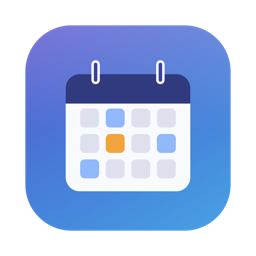

<div align="center">



# Shiftly

**Your shifts, your pay, your work journal — living right inside Apple Calendar.**

💻 macOS 13+ &nbsp;·&nbsp; 🦉 Swift 5.9 &nbsp;·&nbsp; 📄 [PolyForm NC](LICENSE) &nbsp;·&nbsp; 🏷️ [Releases](https://github.com/TN019/shiftly/releases/latest)

[English](README.md) · [简体中文](README.zh-Hans.md)

</div>

---

Shiftly is a native macOS app for anyone who works shifts. Set your weekly
pattern once — Shiftly writes it into a dedicated Apple Calendar, keeps it in
sync **both ways**, works out your pay, and gives every workday a Markdown
journal page. All of it on your Mac, in plain files you own.

## ✨ What it does

### 📅 Calendar sync that goes both ways

Your schedule lands in Apple Calendar — and Apple Calendar talks back.
**Drag a shift to another day** and Shiftly records it as a swap. **Delete
one** and it becomes a day off. **Create one** and it counts as an extra
shift. Every change is listed in a sync report, and any of them can be
undone with one click.

### 🖥 Native desktop widgets & a one-click workday

Real WidgetKit widgets (small and medium) show your next shifts right on the
desktop, with three buttons: **Start Work** runs your morning routine — open
DingTalk, WeChat, websites, a terminal in your work folder — without even
showing the app; **Meeting** jumps to the recorder; **QNotes** pops a note
editor. Configure the routine steps in Settings and start your day in one
click.

### 🎙 Meetings that transcribe themselves

Record meeting audio into timestamped folders, then let
[Scripto](https://github.com/TN019/scripto) transcribe and translate it
locally — no cloud, no GUI, one button each. Play recordings back inside
Shiftly with the transcript highlighted line-by-line as the audio plays;
click any line to jump there.

### 🗓 See your month at a glance

A month view shows regular shifts, swapped days, one-off shifts, leave and
public holidays in different colors. Click any day to swap it, take leave, or
open that day's journal. Import holidays from any subscribed calendar — no
shifts are scheduled on them. Rules keep their history — change your pattern
from next month, and past records stay exactly as they were. Already have
months of shifts in a calendar? Import them as history with their real hours.

### 💰 Know what you've earned

Set your hourly rate (raises keep their effective dates) and Shiftly turns
worked shifts into money: a monthly chart of the last 12 months, year-to-date
totals, per-shift breakdowns, unpaid-break deduction, and payslip export to
CSV or Markdown. Flip the
display between **AUD / CNY / USD** with your own exchange rates — nothing is
ever fetched from the internet.

### 📝 A journal page for every workday

One Markdown file per shift day plus standalone quick notes, stored in
folders *you* choose. Edit and preview them right inside Shiftly
(GitHub-style), or jump to VS Code with one click. Notes written on a day
off land on your last workday's page, and everything is searchable.

### 🔔 Lives in your menu bar

Next shift and countdown at a glance, one-click sync, pre-shift reminders
(configurable lead time), auto-sync on a schedule, auto-launch at login or on
your workdays at a set time. Close the
window — Shiftly keeps working.

### 🤖 Built for the AI era

Everything Shiftly knows lives in human-readable JSON and Markdown, with a
[documented contract](docs/DATA_AND_API.md). A bundled CLI speaks JSON, and an
[MCP server](packages/mcp-server/) lets AI assistants like Claude manage your
schedule in natural language: *"move Wednesday's shift to Friday and sync the
calendar."*

### 🔒 Local-first, private by design

No account. No server. No analytics. First-run setup lays everything out
under one folder you pick — data, logs, notes and meeting recordings — and
each location can be moved later (Shiftly migrates the files for you). Back
them up, sync them, grep them, take them anywhere; a factory reset wipes
exactly what Shiftly created and nothing else.

## 🚀 Get started

```bash
git clone https://github.com/TN019/shiftly.git && cd shiftly
scripts/build_app.sh && cp -R dist/Shiftly.app /Applications/
```

Then it's three steps:

1. **Open Shiftly** and pick a folder for your data (any empty folder works)
2. **Set your weekly pattern** — which days, what hours
3. **Press Sync Now** and allow calendar access

Your shifts are in Apple Calendar. From here on, editing either side keeps
both in sync.

## 📚 Learn more

| | |
|---|---|
| [Setup & technical reference](docs/SETUP.md) | Install details, scheduled sync, migration |
| [Data & interface reference](docs/DATA_AND_API.md) | File schemas, CLI, MCP — the contract for scripts & AI |
| [Sync design](docs/SYNC_DESIGN.md) | How two-way sync works under the hood |
| [Project history](docs/PLAN.md) | The v2 roadmap that built all of this |

## License

[PolyForm Noncommercial 1.0.0](LICENSE) — free for personal and other
noncommercial use; commercial use requires a separate license from the author.

> Required Notice: Copyright (c) 2026 Zishen Liu (https://github.com/TN019/shiftly)
